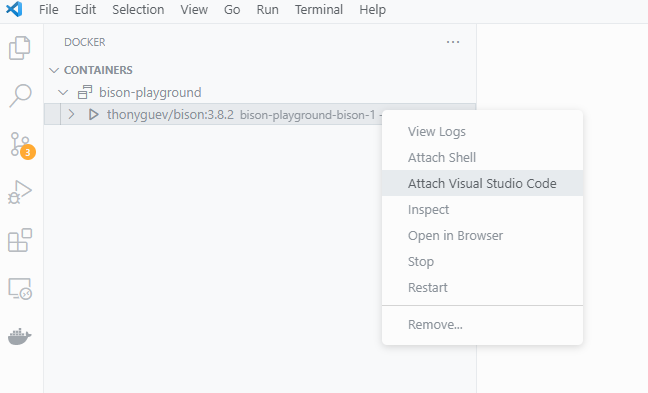
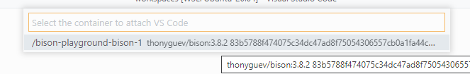

# Bison-Playground

## Descargar la imagen
```bash
docker pull thonyguev/bison:3.8.2
```
## Crear un contenedor
```bash
docker compose create
```
## Ingresar al contenedor por consola
```bash
docker exec -it <ID-CONTAINER> zsh
```
## Ingresar al contenedor por vs code


